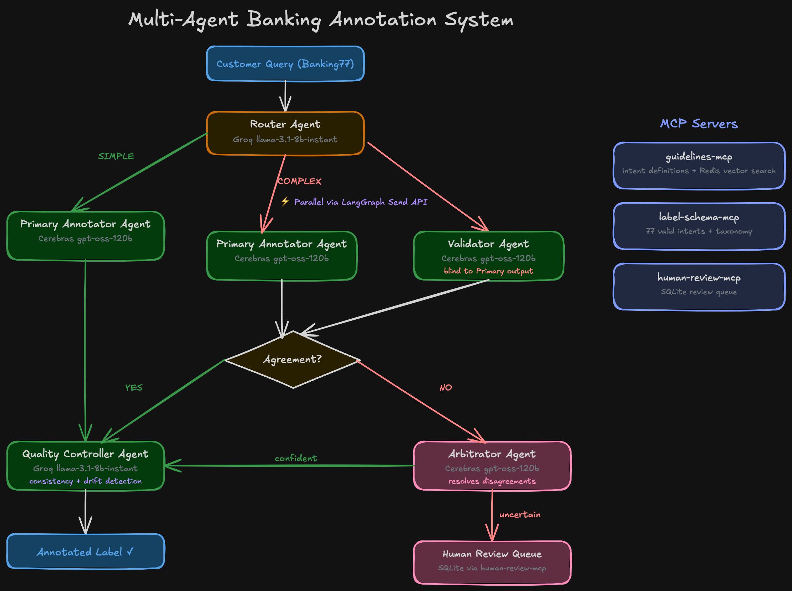

# Multi-Agent Banking Annotation System

[](https://github.com/saviolobo/agentic-annotator/actions/workflows/lint.yml)
[](https://www.python.org/)
[](https://github.com/langchain-ai/langgraph)
[](https://github.com/jlowin/fastmcp)
[](LICENSE)

A production-grade multi-agent pipeline for automated intent classification
on the Banking77 benchmark (13,083 queries, 77 intents), inspired by
JP Morgan's MAFA system (AAAI 2026).


## Results

| | This project | JP Morgan MAFA (AAAI 2026) |
|---|---|---|
| Agreement rate | **95.8%** | 86.0% |
| Macro-F1 | **89.6%** | — |
| Cost per item | **~$0.003** | — |
| Manual annotation | — | ~$0.15 |

> Evaluated on a 333-item holdout sample from the Banking77 test split.
> Full pipeline uses 5 agents with MCP-backed guideline retrieval and
> Redis vector search for similar-example lookup.

---

## Architecture

Five specialized agents replace manual annotation for high-confidence items
while routing ambiguous cases to a human review queue.



**Key pattern:** LangGraph Send API runs Primary Annotator Agent and Validator Agent
in parallel on COMPLEX queries, cutting latency on the most expensive path.

| Agent | Model | Role |
|---|---|---|
| Router Agent | Groq llama-3.1-8b-instant | Classify query complexity (SIMPLE / COMPLEX) |
| Primary Annotator Agent | Cerebras gpt-oss-120b | First-pass label + confidence + reasoning |
| Validator Agent | Cerebras gpt-oss-120b | Independent second annotation, blind to Primary |
| Arbitrator Agent | Cerebras gpt-oss-120b | Resolves disagreements, routes low-confidence to human |
| Quality Controller Agent | Groq llama-3.1-8b-instant | Consistency checks + label drift detection |

---

## MCP Servers

Three [FastMCP](https://github.com/jlowin/fastmcp) servers expose tools to agents at inference time:

| Server | Tools |
|---|---|
| `guidelines-mcp` | Intent definitions + Redis vector search for similar labeled examples |
| `label-schema-mcp` | 77 valid intent labels + taxonomy + confusion-prone pairs |
| `human-review-mcp` | SQLite-backed queue for low-confidence items awaiting human review |

---

## Stack

| Layer | Technology |
|---|---|
| Orchestration | LangGraph + SqliteSaver checkpointing |
| MCP servers | FastMCP |
| Vector search | Redis Stack + sentence-transformers/all-MiniLM-L6-v2 |
| API | FastAPI |
| Frontend | Next.js 15 + shadcn/ui + Recharts |
| Tracing | Langfuse (self-hosted) |
| Dataset | Banking77 — PolyAI (CC-BY 4.0) |

---

## Setup

```bash
cp .env.example .env        # add GROQ_API_KEY, CEREBRAS_API_KEY
uv sync
docker compose up -d        # Langfuse tracing
colima start && docker run -d -p 6379:6379 redis/redis-stack:latest
uv run python mcp_servers/guidelines_mcp/indexer.py
uv run python main.py       # API on :8000
cd frontend && npm run dev  # Dashboard on :3000
```

---

## Eval

```bash
# Smoke test — 10 fixture items
make eval-smoke

# Full ablation — 500 items, saves progress after every item
caffeinate -i uv run python -m eval.run_eval \
  --configs 1 2 3 --n 500 --output eval_results.json

# Retry failed items (rate limits etc.)
caffeinate -i uv run python -m eval.retry_errors \
  --input eval_results.json --sleep 60
```

---

## Reference

Inspired by: *MAFA: Multi-Agent Framework for Annotation*, JP Morgan Chase, AAAI 2026.
Dataset: [PolyAI/banking77](https://github.com/PolyAI-LDN/task-specific-datasets) — CC-BY 4.0.

---

## License

MIT © [Savio Lobo](https://github.com/saviolobo)
